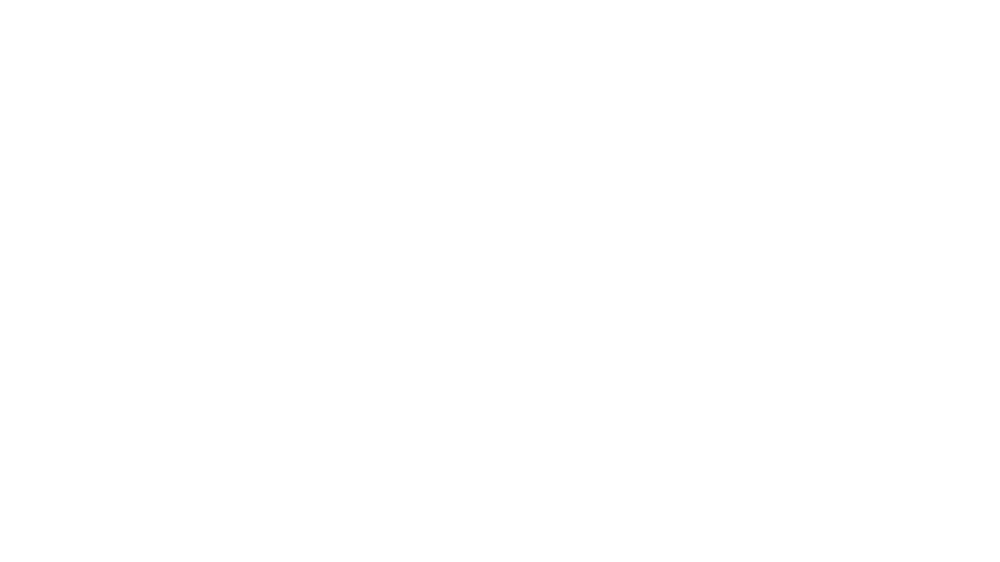

# TinkerPet

> Desktop AI companion robot / 桌面 AI 陪伴机器人

TinkerPet is a desktop companion robot designed for the new “AI waiting moments” created by modern AI workflows. It turns fragmented waiting time into a lightweight loop of companionship, playful interaction, and clear completion feedback.

TinkerPet 是一个面向 AI 工作流等待场景的桌面陪伴机器人。它尝试把用户等待 AI 执行结果的碎片时间，转化为轻量陪伴、可玩互动和明确反馈。

---

## Preview / 效果图

> Replace this placeholder image with the final robot visual.  
> 请将下方占位图替换为最终机器人效果图。



Recommended image path:

```txt
docs/images/tinkerpet-robot-preview.png
```

---

## Why TinkerPet / 项目背景

AI is becoming part of everyday work: coding, writing, research, design, automation, and office tasks. As AI tools move from chat windows into desktop apps, IDEs, plugins, and workflow agents, users increasingly experience many short waiting periods.

These waiting moments are small, but they happen frequently. They can create uncertainty, fragmented attention, and the habit of switching to short-form content while waiting.

TinkerPet explores a different interaction model:

- Let users feel that “something is happening”.
- Make completion feedback visible and friendly.
- Keep the companion playful without becoming distracting.
- Turn waiting time into a small product experience rather than empty time.

随着 AI 深入办公、编码、写作、研究、设计和自动化流程，用户越来越频繁地进入“等待 AI 执行结果”的状态。尤其当 AI 从浏览器聊天框扩展到桌面应用、IDE、插件和工作流代理后，这种等待不再是单一页面里的加载，而是分散在整个工作环境中的微小空档。

这些等待时间并不长，却非常高频。它们容易带来不确定感、注意力切换，以及“顺手刷短视频”的碎片化行为。

TinkerPet 试图探索一种新的等待体验：

- 让用户感知任务正在推进。
- 让完成反馈更清晰、更友好。
- 让陪伴感有趣但不打扰。
- 把等待时间变成产品体验的一部分，而不是空白时间。

---

## Product Vision / 产品愿景

TinkerPet is not just a cute desktop widget. It is a small emotional interface for AI productivity tools.

The long-term vision is to become a companion layer that sits across AI tools, workflow automation, coding agents, and desktop productivity apps.

TinkerPet 不只是一个可爱的桌面挂件。它更像是 AI 生产力工具之上的一个轻量情绪界面。

长期来看，它可以作为一个跨 AI 工具、工作流自动化、编码代理和桌面办公应用的陪伴层：理解任务状态，陪伴等待过程，并在关键节点提醒用户回到主线。

---

## Highlights / 项目亮点

### 1. AI waiting companion / AI 等待陪伴

TinkerPet reacts to task states such as started, finished, and failed. When AI is working, the robot enters a waiting/performance state. When the task completes, it provides a clear visual signal.

TinkerPet 可以根据任务开始、完成、失败等事件切换状态。AI 执行中，机器人进入等待或表演状态；任务完成后，通过明确的视觉反馈提醒用户。

### 2. Desktop-first experience / 桌面优先体验

The MVP prioritizes the macOS desktop pet experience, because modern AI workflows increasingly happen in desktop apps, IDEs, and agents instead of only browser chat pages.

MVP 优先面向 macOS 桌面端，因为越来越多 AI 工作流已经不只发生在浏览器聊天页面，而是出现在桌面应用、IDE、编码代理和插件中。

### 3. 3D robot motion system / 3D 机器人动作系统

The current version includes a 3D robot model, motion scheduling, idle walking, waiting performances, finish effects, failure feedback, interaction response, and anti-fatigue rhythm control.

当前版本已经包含 3D 机器人模型、动作调度、待机行走、等待表演、完成提醒、失败反馈、点击互动和防疲劳节奏控制。

### 4. Playful retention loop / 轻量留存循环

TinkerPet includes growth values, level, decor points, daily reports, share cards, and a Quick Play Gomoku mini-game.

TinkerPet 内置成长值、等级、装饰点数、每日报告、分享图，以及 Quick Play 五子棋小游戏，帮助产品从“工具提醒”延展到“陪伴养成”。

### 5. Local-first prototype / 本地优先原型

The current prototype stores data locally and can receive local events from browser plugins, CLI wrappers, IDE integrations, and debug tools.

当前原型以本地数据存储为主，可通过本地事件桥接接入浏览器插件、CLI wrapper、IDE 插件和调试工具。

---

## Current Capabilities / 当前能力

- macOS desktop pet window
- Menu bar controls: show/hide, settings, debug panel, daily report, quick play
- Local event bridge for AI/workflow status
- 3D robot rendering with Three.js
- Motion scheduler for idle/waiting/finished/failed/sleeping states
- Completion effect with paper-plane/envelope style notification
- Runtime motion tuning in the debug/settings panel
- Quick Play Gomoku game with local AI opponent
- XP, level, decor points, local game history
- Daily waiting report and share card

---

## Use Cases / 使用场景

- Waiting for ChatGPT, Claude, Gemini, or other AI tools to finish a long response
- Waiting for coding agents to complete tasks
- Waiting for local scripts, CLI wrappers, or automation workflows
- Turning small idle moments into lightweight interaction
- Building an emotional layer for productivity tools

适用场景：

- 等待 ChatGPT、Claude、Gemini 等 AI 工具完成长响应
- 等待编码代理执行任务
- 等待本地脚本、CLI wrapper 或自动化工作流完成
- 把碎片化空档变成轻量互动
- 为生产力工具增加一层情绪化反馈

---

## Roadmap Direction / 路线方向

Current iteration focus:

- V0.5: Quick Play game loop
- V0.6: Robot motion system and completion feedback

Planned directions:

- Better 3D animation assets and richer robot expressions
- More AI tool integrations
- VS Code / Cursor / CLI workflow integration
- More desktop mini-games and opponent-style interactions
- Better reports, sharing, and long-term companion growth

当前迭代重点：

- V0.5：Quick Play 对战玩法闭环
- V0.6：机器人动作系统与完成反馈

后续方向：

- 更高质量的 3D 动作资产与表情系统
- 接入更多 AI 工具与 IM/办公渠道
- VS Code / Cursor / CLI 工作流联动
- 更多桌面小游戏和对手型互动
- 更完整的报告、分享和长期养成体验

---

## Tech Stack / 技术栈

- Electron
- React + TypeScript
- Vite / electron-vite
- Three.js
- Local JSON persistence
- Local HTTP event bridge

---

## Quick Start / 快速启动

```sh
npm install
npm run dev
```

After launch, use the `TinkerPet` menu bar item to open:

- Settings
- Debug Panel
- Daily Report
- Quick Play

启动后，可通过 macOS 菜单栏中的 `TinkerPet` 入口打开设置、调试面板、每日报告和 Quick Play。

---

## Verification / 验证

```sh
npm run typecheck
npm run lint
npm run build
```

---

## Local Event Bridge / 本地事件桥接

Default endpoint:

```txt
http://127.0.0.1:17321/events
```

Token and port are stored in:

```sh
~/Library/Application Support/tinkerpet/tinkerpet-config.json
```

Example payload:

```json
{
  "type": "AI_TASK_STARTED",
  "source": "manual-test",
  "title": "Generating report"
}
```

Supported event types:

- `AI_TASK_STARTED`
- `AI_TASK_FINISHED`
- `AI_TASK_FAILED`
- `WORKFLOW_TASK_STARTED`
- `WORKFLOW_TASK_FINISHED`
- `WORKFLOW_TASK_FAILED`

---

## Robot Asset / 机器人资产

Runtime asset:

```txt
src/renderer/pet/assets3d/models/robot.glb
```

Source reference:

[Sketchfab Robot](https://sketchfab.com/3d-models/robot-80a736ddac1044299b134cfcca87c7f9)

---

## Project Status / 项目状态

TinkerPet is an evolving product prototype. The project is currently focused on validating whether desktop pets can become a meaningful companion layer for AI productivity workflows.

TinkerPet 目前处于持续迭代的产品原型阶段，核心目标是验证桌面宠物是否可以成为 AI 生产力工作流中的有效陪伴层。
