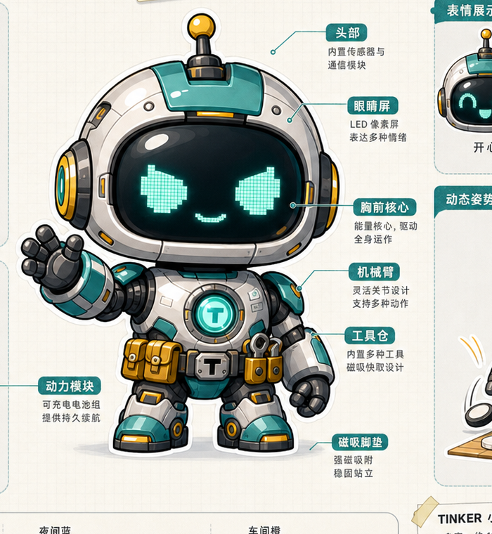

# TinkerPet

TinkerPet is a macOS desktop companion robot for AI waiting moments.

It stays on your desktop, listens to AI/workflow progress, reacts with expressive robot motions, and helps convert fragmented waiting time into lightweight, playful interaction.

## Robot Design Preview



## Current Scope (V0.1 -> V0.6)

- Desktop pet window (transparent, frameless, always-on-top configurable).
- Menu bar tray controls: show/hide, reset position, settings/debug/report/quick-play.
- Local event bridge (`/events`) for AI and workflow status events.
- Quick Play (Gomoku) side game with local AI difficulty modes and match history.
- Growth loop: XP, level, decor points, personality feedback, daily report, share card.
- 3D robot rendering (`.glb`) with motion scheduler (idle/waiting/finished/failed/sleeping).
- V0.6 motion upgrades:
  - idle walk + occasional jog burst
  - waiting showcase pool
  - finish notification effect (paper-plane/envelope)
  - anti-fatigue rhythm controls

## Tech Stack

- Electron + React + TypeScript
- Vite / electron-vite
- Three.js (3D robot rendering)
- Local JSON stores in app data directory

## Quick Start

```sh
npm install
npm run dev
```

After launch, use the `TinkerPet` item in the macOS menu bar to open:
- Settings
- Debug Panel
- Daily Report
- Quick Play

## Verification

```sh
npm run typecheck
npm run lint
npm run build
```

## Local Event Bridge

The bridge uses bearer token auth. Token and port are stored in:

```sh
~/Library/Application Support/tinkerpet/tinkerpet-config.json
```

Default endpoint:

```txt
http://127.0.0.1:17321/events
```

Example payload:

```json
{
  "type": "AI_TASK_STARTED",
  "source": "manual-test",
  "title": "Generating report"
}
```

Supported event types:

- `AI_TASK_STARTED`
- `AI_TASK_FINISHED`
- `AI_TASK_FAILED`
- `WORKFLOW_TASK_STARTED`
- `WORKFLOW_TASK_FINISHED`
- `WORKFLOW_TASK_FAILED`
